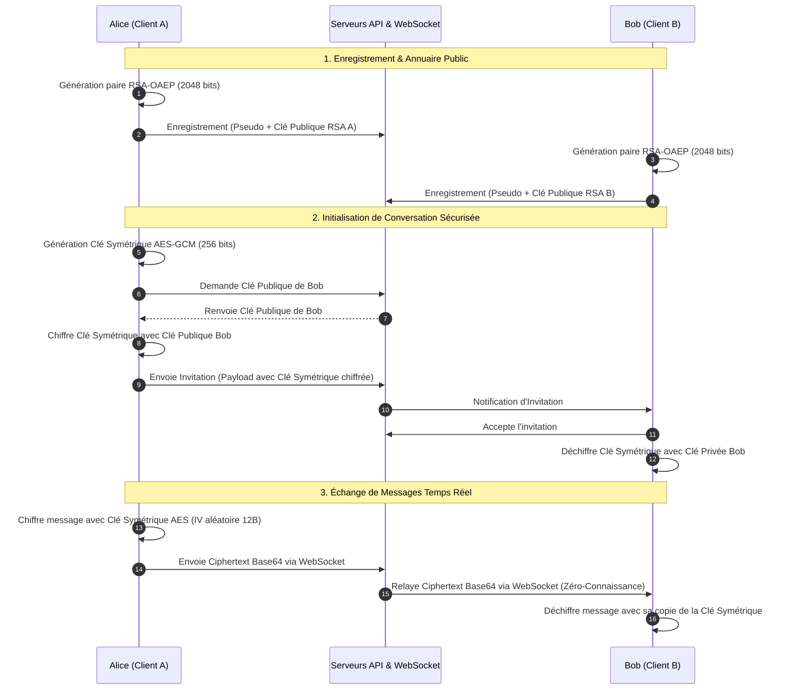

# Privy : Messagerie Chiffrée de Bout en Bout & Rétrospective d'Ingénierie

[English](README.md) | **Français**

[](https://github.com/the-voxel-studio/privy)
[](https://www.gnu.org/licenses/gpl-3.0)
[](#-r%C3%A9trospective-technique--dette-critique)
[](https://vuejs.org/)
[](https://nodejs.org/)
[](https://github.com/websockets/ws)
[](https://capacitorjs.com/)
[](https://www.mysql.com/)

> [!NOTE]
> **Note de Contexte & Rétrospective d'Ingénierie :**  
> Ce projet a été initialement imaginé et développé en totale autonomie comme un projet d'apprentissage autodidacte **avant mon entrée en école d'ingénieur en informatique**.  
> En **juillet 2026**, à l'issue de ma première année d'école d'ingénieur, j'ai mené un **audit critique et sans concession** de cette base de code. Cette analyse met en perspective mes premiers choix d'implémentation face aux standards industriels de sécurité, d'architecture distribuée et de performance.  
> Le projet est aujourd'hui **abandonné et archivé** en tant qu'étude de cas pédagogique illustrant la progression des compétences en génie logiciel.

---

## 📖 Sommaire

1. [Qu'était Privy ? (Description du Projet)](#-qu%C3%A9tait-privy--description-du-projet)
   * [Concept & Vision d'Origine](#concept--vision-dorigine)
   * [Fonctionnalités Utilisateur](#fonctionnalit%C3%A9s-utilisateur)
   * [Fonctionnement Cryptographique (Chiffrement de Bout en Bout)](#fonctionnement-cryptographique-chiffrement-de-bout-en-bout)
2. [Rétrospective Technique & Dette Critique (Les 8 Failles Majeures)](#-r%C3%A9trospective-technique--dette-critique)
   * [1. Fuite des Clés Privées dans le `localStorage` (Vulnérabilité XSS)](#1-fuite-des-cl%C3%A9s-priv%C3%A9es-dans-le-localstorage-vuln%C3%A9rabilit%C3%A9-xss)
   * [2. Blocage du Thread Principal via `pbkdf2Sync` Bloquant](#2-blocage-du-thread-principal-via-pbkdf2sync-bloquant)
   * [3. Architecture Temps Réel Inversée : Polling HTTP depuis le WebSocket](#3-architecture-temps-r%C3%A9el-invers%C3%A9e--polling-http-depuis-le-websocket)
   * [4. Rigidité du Modèle Relationnel (Blocage des Groupes)](#4-rigidit%C3%A9-du-mod%C3%A8le-relationnel-blocage-des-groupes)
   * [5. Déconnexion Inefficace et Complexité $O(R)$ en Mémoire](#5-d%C3%A9connexion-inefficace-et-complexit%C3%A9-or-en-m%C3%A9moire)
   * [6. Découpage Binaire de Fichiers en MySQL (Anti-pattern `FileChunks`)](#6-d%C3%A9coupage-binaire-de-fichiers-en-mysql-anti-pattern-filechunks)
   * [7. Sur-provisionnement des Permissions Android (`AndroidManifest.xml`)](#7-sur-provisionnement-des-permissions-android-androidmanifestxml)
   * [8. Absence de Réactivité & Problème de Jeton Périmé (Stale Token)](#8-absence-de-r%C3%A9activit%C3%A9--probl%C3%A8me-de-jeton-p%C3%A9rim%C3%A9-stale-token)
3. [Alternatives d'Ingénierie : Comment Concevoir Privy pour la Production](#-alternatives-ding%C3%A9nierie--comment-concevoir-privy-pour-la-production)
4. [Architecture Technique & Schémas](#-architecture-technique--sch%C3%A9mas)
   * [Schéma Fonctionnel & Réseau](#sch%C3%A9ma-fonctionnel--r%C3%A9seau)
   * [Diagramme de Séquence Cryptographique](#diagramme-de-s%C3%A9quence-cryptographique)
5. [Structure du Dépôt](#-structure-du-d%C3%A9p%C3%B4t)
6. [Modèle de Données (MySQL)](#-mod%C3%A8le-de-donn%C3%A9es-mysql)
7. [Configuration & Déploiement Historique](#-configuration--d%C3%A9ploiement-historique)
8. [Licence](#-licence)

---

## 💡 Qu'était Privy ? (Description du Projet)

### Concept & Vision d'Origine

**Privy** est né de la volonté de concevoir une application de messagerie instantanée souveraine, confidentielle et sécurisée de bout en bout, en s'affranchissant des géants technologiques centralisés.

L'objectif était d'appliquer le principe de **divulgation nulle de connaissances (*Zero-Knowledge*)** : les serveurs d'infrastructure ne devaient servir que de relais aveugles de paquets chiffrés, sans jamais avoir la capacité technique de lire le contenu des conversations ou d'accéder aux clés de chiffrement symétriques des utilisateurs.

### Fonctionnalités Utilisateur

* **Création d'Identité Cryptographique :** Inscription par pseudonyme avec génération automatique à la volée d'une paire de clés asymétriques sur l'appareil du client.
* **Système d'Invitations Sécurisées :** Pour démarrer un échange, l'émetteur génère un salon, crée une clé de session symétrique, la chiffre avec la clé publique du destinataire, et lui soumet une invitation que le destinataire peut accepter ou refuser.
* **Échanges Temps Réel :** Discussion fluide propulsée par un serveur WebSocket avec accusé d'envoi et indicateurs de frappe (*typing indicators*).
* **Déploiement Hybride Web & Mobile :** Interface réactive conçue en Vue 3, encapsulée sous forme d'application mobile Android via Capacitor (un fichier compilé `privy.apk` est conservé à la racine du dépôt).
* **Partage de Fichiers (Ébauche) :** Système expérimental de découpage binaire de pièces jointes.

---

### Fonctionnement Cryptographique (Chiffrement de Bout en Bout)

Le modèle de chiffrement implémenté dans Privy repose sur une architecture hybride exploitant l'API standard **Web Crypto** (`window.crypto.subtle`) :

```text
[Utilisateur A]                                                    [Utilisateur B]
       │                                                                  │
1. Enregistrement                                                         │
   Génère paire RSA-OAEP (2048 bits)                                       │
   Envoie Clé Publique A ──────> [ Serveur MySQL ] <────── Reçoit Clé Publique B
       │                                                                  │
2. Création de Conversation                                               │
   Génère clé AES-GCM (256 bits)                                          │
   Chiffre clé AES avec Clé Publique B                                    │
   Envoie Invitation chiffrée ──> [ Serveur API ] ───────> Reçoit Invitation
                                                                          │
                                                           Déchiffre clé AES
                                                           avec Clé Privée B
       │                                                                  │
3. Échange de Messages                                                    │
   Chiffre texte avec AES-GCM                                             │
   IV aléatoire (12 octets)                                               │
   Envoie Ciphertext Base64 ───> [ Serveur WebSocket ] ──> Reçoit Ciphertext
                                                           Déchiffre avec AES-GCM
```

1. **Génération d'Identité Asymétrique (RSA-OAEP 2048 bits) :**
   * Lors de l'inscription, le navigateur génère une paire de clés RSA-OAEP avec hachage SHA-256 via `window.crypto.subtle.generateKey`.
   * La clé publique (format SPKI exporté en Base64) est envoyée à l'API et stockée dans la table `Users.public_key`.
2. **Échange de Clés Symétriques par Enveloppe Numérique :**
   * L'initiateur génère une clé symétrique **AES-GCM 256 bits**.
   * Cette clé est chiffrée avec la clé publique RSA du destinataire (`encryptKey`), puis transmise dans le corps d'une invitation.
   * En acceptant l'invitation, le destinataire utilise sa clé privée locale pour déchiffrer la clé de conversation (`decryptKey`).
3. **Chiffrement Symétrique des Messages (AES-GCM) :**
   * Chaque message est chiffré localement avec la clé AES-GCM de la conversation.
   * Un vecteur d'initialisation (IV) de 12 octets est généré aléatoirement pour chaque message (`window.crypto.getRandomValues`) et préfixé au texte chiffré avant encodage en Base64.
   * Le serveur WebSocket ne reçoit et ne stocke que ce blob opaque Base64.

---

## 🔍 Rétrospective Technique & Dette Critique

*(Synthèse de l'analyse menée en juillet 2026 après un an d'études d'ingénieur en informatique)*

Bien que fonctionnel en tant que prototype, le projet comportait des faiblesses architecturales et de sécurité majeures qui justifient son abandon en l'état.

### 1. Fuite des Clés Privées dans le `localStorage` (Vulnérabilité XSS)
* **Constat dans le code :** Dans [useEncryption.js](file:///home/armand/privy/frontend/src/composables/useEncryption.js#L88-L89), la clé privée RSA et les clés symétriques de chaque salon sont écrites directement en clair dans le `window.localStorage` du navigateur.
* **Impact sécurité :** N'importe quelle faille XSS (injection d'un script malveillant via une dépendance compromise ou une mauvaise neutralisation de contenu) permettrait à un attaquant d'extraire l'intégralité des clés privées et des secrets de session en une seule ligne de code JavaScript (`localStorage.getItem('privateKey')`), anéantissant totalement la promesse de chiffrement de bout en bout.

### 2. Blocage du Thread Principal via `pbkdf2Sync` Bloquant
* **Constat dans le code :** Dans [authController.js](file:///home/armand/privy/backend/api/controllers/authController.js#L16), le hachage des mots de passe à l'inscription et à la connexion est exécuté via l'instruction synchrone `crypto.pbkdf2Sync(password, salt, 1000, 64, 'sha512')`.
* **Impact performance :** Node.js reposant sur une boucle d'événements à thread unique (*Single-Threaded Event Loop*), chaque appel à une fonction de hachage synchrone mobilise à 100 % le thread principal pendant plusieurs dizaines de millisecondes. Sous une charge de requêtes simultanées, l'API ne peut plus traiter aucune requête entrante, entraînant une dégradation immédiate du temps de réponse pour l'ensemble des utilisateurs.

### 3. Architecture Temps Réel Inversée : Polling HTTP depuis le WebSocket
* **Constat dans le code :** Dans [wss.js](file:///home/armand/privy/backend/websocket/config/wss.js#L53-L60) et [auth.js](file:///home/armand/privy/backend/websocket/auth.js#L11-L14), le serveur WebSocket n'a pas accès à la base de données ni à un cache partagé. Pour vérifier la validité de la session, il lance un intervalle toutes les 30 secondes pour **chaque client connecté** en effectuant une requête HTTP externe (`axios.get`) vers l'API REST ! De plus, le routeur frontend (`router.js`) déclenche un appel HTTP à chaque changement de vue.
* **Impact réseau :** Avec 1 000 utilisateurs connectés en WebSocket, le serveur auto-générait **2 000 requêtes HTTP par minute** entre ses propres services simplement pour vérifier des tokens qui disposent déjà d'une signature cryptographique autonome.

### 4. Rigidité du Modèle Relationnel (Blocage des Groupes)
* **Constat dans le code :** Dans [architecture.sql](file:///home/armand/privy/backend/db/architecture.sql#L15-L23), la table `Conversations` contient deux colonnes rigides `creator_id` et `participant_id` avec une contrainte `UNIQUE (creator_id, participant_id)`.
* **Impact architectural :** Cette modélisation enferme l'application dans un format strictement bilatéral (1-on-1). L'ajout de salons de groupe, d'administrateurs multiples ou de membres invités s'avère impossible sans reconstruire entièrement le schéma de données et réécrire les contrôleurs.

### 5. Déconnexion Inefficace et Complexité $O(R)$ en Mémoire
* **Constat dans le code :** Lors de la déconnexion d'un utilisateur, le serveur WebSocket parcourait l'ensemble des salons existants en mémoire (`activeRooms.forEach`) pour localiser et détacher le socket du client.
* **Impact passage à l'échelle :** La complexité algorithmique de déconnexion est linéaire par rapport au nombre total de salons $O(R)$ plutôt que d'être constante $O(1)$, induisant une consommation CPU inutile à mesure que le nombre de salons augmente.

### 6. Découpage Binaire de Fichiers en MySQL (Anti-pattern `FileChunks`)
* **Constat dans le code :** Les tables `Files` et `FileChunks` visaient à découper les fichiers envoyés en tranches binaires de 255 octets (`VARBINARY(255)`) insérées une à une dans MySQL.
* **Impact base de données :** Pour un fichier de seulement 5 Mo, ce schéma aurait nécessité l'insertion et l'indexation de plus de **20 000 lignes** en base relationnelle, saturant les tablespaces InnoDB, générant une surcharge mémoire colossale et provoquant une fragmentation sévère. Cette fonctionnalité a été abandonnée en cours de développement et ses routes désactivées.

### 7. Sur-provisionnement des Permissions Android (`AndroidManifest.xml`)
* **Constat dans le code :** Le manifeste Capacitor Android déclarait des autorisations invasives : géolocalisation précise (`ACCESS_FINE_LOCATION`), accès à la caméra (`CAMERA`) et enregistrement audio (`RECORD_AUDIO`).
* **Origine :** Ces permissions avaient été ajoutées lors de tests empiriques pour tenter de résoudre des dysfonctionnements d'accès au stockage local.
* **Impact conformité :** Violation flagrante du **principe du moindre privilège**, provoquant un rejet immédiat lors de toute soumission sur le Google Play Store et suscitant la méfiance légitime des utilisateurs.

### 8. Absence de Réactivité & Problème de Jeton Périmé (Stale Token)
* **Constat dans le code :** Dans les composables frontend (`useConversations.js`, `useMessages.js`), le token JWT était lu une seule fois lors de l'évaluation du module JavaScript (`localStorage.getItem('token')`).
* **Impact ergonomique :** Après une connexion réussie, la variable en mémoire restait `null` dans les autres composables déjà importés, provoquant des erreurs 401 immédiates jusqu'à ce que l'utilisateur recharge manuellement sa page. Par ailleurs, le composant WebSocket tentait une reconnexion infinie toutes les 5 secondes même après une déconnexion volontaire.

---

## 🛠 Alternatives d'Ingénierie : Comment Concevoir Privy pour la Production

Si ce projet devait être réécrit selon les standards de l'art logiciel :

| Composant | Solution Implémentée (PoC Naïf) | Solution Industrielle Recommandée |
| :--- | :--- | :--- |
| **Stockage des Clés** | Plaintext dans `window.localStorage` | Clés non extractibles (`extractable: false`) dans **IndexedDB** via Web Crypto API, ou dérivation locale de clé par mot de passe maître via **Argon2id**. |
| **Hachage des Passwords** | `crypto.pbkdf2Sync` (1 000 itérations, bloquant) | Hachage asynchrone non-bloquant avec **Argon2id** ou **bcrypt** délégué au pool de threads libuv de Node.js. |
| **Validation WebSocket** | Requête HTTP Axios toutes les 30s vers l'API | Validation cryptographique locale de la signature du JWT (clé secrète partagée) sans aucun appel réseau. |
| **Gestion des Salons** | Colonnes `creator_id` / `participant_id` (1-on-1) | Table d'association Many-to-Many `ConversationMembers (conversation_id, user_id, role)`. |
| **Stockage Fichiers** | Micro-chunks de 255 octets dans MySQL | Stockage objet compatible **S3 / MinIO** pour les blobs chiffrés, avec uniquement les métadonnées et hash en base. |
| **Gestion d'État Frontend** | Variables globales de modules JS | Store réactif **Pinia** avec intercepteurs Axios centralisés pour l'injection du header Authorization et la gestion du refresh. |
| **Permissions Mobiles** | Déclarations statiques globales (GPS, Micro, Caméra) | Seule permission réseau (`INTERNET`) et demandes de permissions dynamiques au runtime au moment de l'action. |

---

## 🏗 Architecture Technique & Schémas

### Schéma Fonctionnel & Réseau

```mermaid
flowchart TD
    subgraph Clients["Clients Utilisateurs"]
        WEB["Navigateur Web (Vue 3 / Vite)"]
        MOB["Application Mobile Android (Capacitor)"]
    end

    subgraph BackendInfrastructure["Infrastructure Backend (Docker)"]
        API["API REST Express (Port 3000)<br/>- Authentification JWT<br/>- Profils & Invitations"]
        WS["Serveur WebSocket ws (Port 3001)<br/>- Relais de messages chiffrés<br/>- Indicateurs de frappe"]
        DB[("Base de Données MySQL 5.7 (Port 3306)<br/>- Utilisateurs & Clés publiques<br/>- Salons & Métadonnées")]
        PMA["phpMyAdmin (Port 8080)"]
    end

    WEB -->|HTTP / REST| API
    MOB -->|HTTP / REST| API
    WEB <-->|Connexion WebSocket| WS
    MOB <-->|Connexion WebSocket| WS

    API -->|Requêtes SQL| DB
    WS -.->|Polling HTTP 30s<br/>(Dette technique)| API
    PMA --> DB
```

---

### Diagramme de Séquence Cryptographique



---

## 📁 Structure du Dépôt

```text
privy/
├── backend/                  # Services serveurs
│   ├── api/                  # API REST Express (authentification, profils, invitations)
│   │   ├── controllers/      # Contrôleurs métier
│   │   ├── models/           # Modèles d'accès MySQL
│   │   └── routes/           # Définition des routes REST
│   ├── websocket/            # Serveur WebSocket (messagerie en direct)
│   │   ├── config/           # Configuration du serveur wss
│   │   └── services/         # Dispatch des messages et frappe
│   ├── db/                   # Scripts SQL d'initialisation et schéma
│   ├── docker-compose.yml    # Orchestration des conteneurs (Node 24, MySQL 5.7)
│   └── README.md             # Rétrospective dédiée au backend
├── frontend/                 # Client Single Page Application (Vue 3, Vite, Pinia)
│   ├── src/
│   │   ├── components/       # Vues d'authentification, profils et messagerie
│   │   ├── composables/      # Logique métier et primitives cryptographiques
│   │   └── stores/           # Store WebSocket Pinia
│   └── README.md             # Rétrospective dédiée au frontend
├── capacitor/                # Configuration du wrapper mobile Android
│   ├── android/              # Projet natif Android Studio
│   └── README.md             # Analyse des permissions mobiles
├── privy.apk                 # Fichier exécutable Android compilé historique
├── LICENSE                   # Licence GPL v3
└── README.md                 # Documentation principale (Anglais)
```

---

## 🗄 Modèle de Données (MySQL)

Le schéma relationnel initial (`backend/db/architecture.sql`) est structuré comme suit :

* `Users` : Identifiants, pseudonyme unique, sel cryptographique, hachage du mot de passe et clé publique RSA-OAEP.
* `Conversations` : Table de liaison stricte limitant les échanges à un créateur et un unique participant.
* `Messages` : Historique des messages stockant le texte chiffré (`message_content TEXT`) sans clé de déchiffrement.
* `Invitations` : Demandes d'échange en attente contenant la clé de session chiffrée (`payload TEXT`).
* `Files` & `FileChunks` : Modélisation abandonnée prévoyant le stockage de micro-blocs de fichiers binaires.

---

## 🚀 Configuration & Déploiement Historique

> [!WARNING]
> Ce projet utilise des dépendances obsolètes (notamment MySQL 5.7 en fin de vie) et présente des failles de conception documentées ci-dessus. Il ne doit **jamais** être déployé dans un environnement ouvert ou de production.

### 1. Variables d'Environnement

* **Backend (`backend/.env`) :**
  ```dotenv
  DB_HOST=privy_mysql_db
  DB_USER=privy_user
  DB_PASSWORD=password
  DB_NAME=privy
  DB_ROOT_PASSWORD=root_password
  PMA_HOST=privy_mysql_db
  PMA_PORT=3306

  ACCESS_TOKEN_SECRET=votre_secret_jwt_a_changer
  ACCESS_TOKEN_EXPIRATION=5d
  MESSAGE_TOKEN_SECRET=votre_secret_message_a_changer
  MESSAGE_TOKEN_EXPIRATION=5m

  WSS_PORT=3001
  PROD=false

  API_PORT=3000
  API_HOST=privy_api_service
  API_URL=http://privy_api_service:3000/api
  ```

* **Frontend (`frontend/.env`) :**
  ```dotenv
  VITE_API_URL=http://localhost:3000
  VITE_WEBSOCKET_URL=ws://localhost:3001
  ```

### 2. Démarrage des Conteneurs Backend
```bash
cd backend
docker-compose up -d --build
```
* API REST : `http://localhost:3000`
* Serveur WebSocket : `ws://localhost:3001`
* phpMyAdmin : `http://localhost:8080`

### 3. Lancement du Frontend Vue 3
```bash
cd frontend
npm install
npm run dev
```
Accès à l'application web : `http://localhost:5173`

---

## 📄 Licence

Ce projet est distribué sous licence libre **GNU General Public License v3 (GPLv3)**.  
Consultez le fichier [LICENSE](LICENSE) pour plus de précisions.
