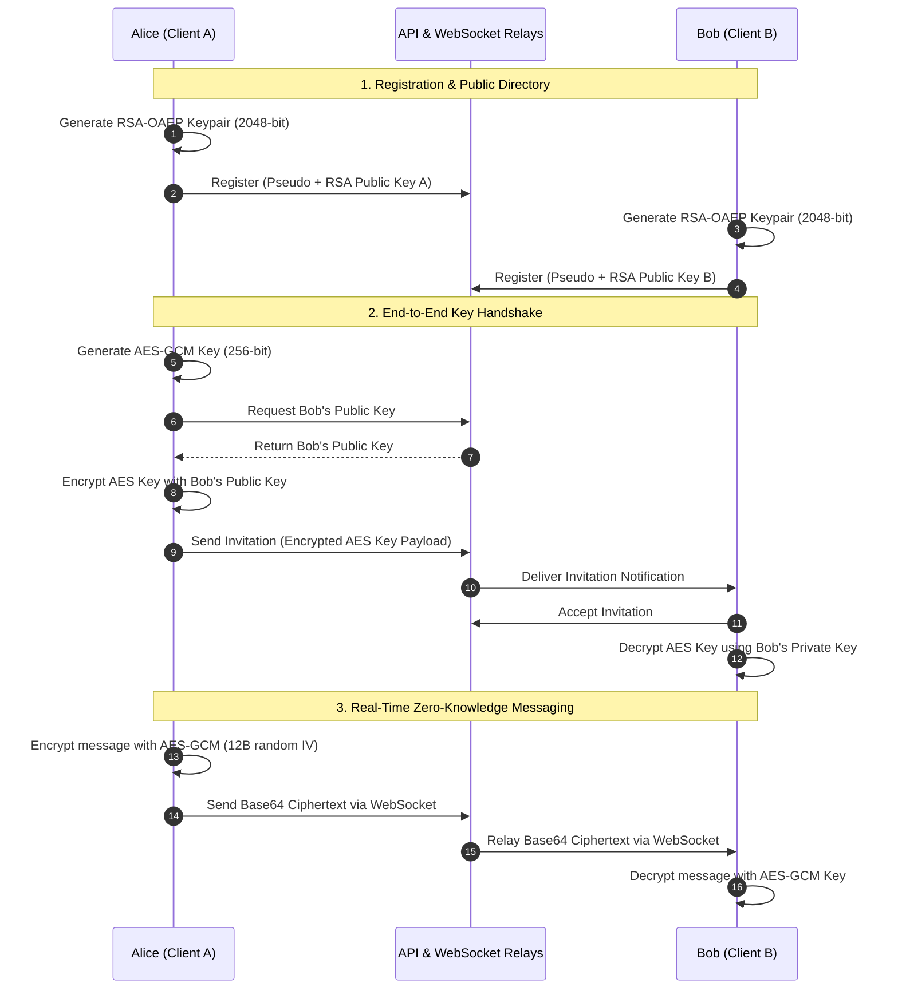

# Privy: End-to-End Encrypted Messaging & Engineering Retrospective

**English** | [Français](README.fr.md)

[](https://github.com/the-voxel-studio/privy)
[](https://www.gnu.org/licenses/gpl-3.0)
[](#-technical-retrospective--critical-debt)
[](https://vuejs.org/)
[](https://nodejs.org/)
[](https://github.com/websockets/ws)
[](https://capacitorjs.com/)
[](https://www.mysql.com/)

> [!NOTE]
> **Context Note & Engineering Retrospective:**  
> This project was originally designed and built from scratch as an ambitious, self-taught learning endeavor **before entering computer engineering school**.  
> In **July 2026**, following the completion of my first year in computer engineering school, I performed an **uncompromising technical audit** of this codebase. This analysis juxtaposes my initial beginner implementation decisions against industry standards for security, distributed architecture, and system performance.  
> The project is **abandoned and archived** as an educational case study reflecting real-world engineering growth and technical lessons learned.

---

## 📖 Table of Contents

1. [What was Privy? (Project Overview)](#-what-was-privy-project-overview)
   * [Core Concept & Vision](#core-concept--vision)
   * [User Features](#user-features)
   * [Cryptographic Architecture (End-to-End Encryption Flow)](#cryptographic-architecture-end-to-end-encryption-flow)
2. [Technical Retrospective & Critical Debt (The 8 Major Flaws)](#-technical-retrospective--critical-debt)
   * [1. Private Key Exposure in `localStorage` (XSS Vulnerability)](#1-private-key-exposure-in-localstorage-xss-vulnerability)
   * [2. Main Event Loop Blocking via Synchronous `pbkdf2Sync`](#2-main-event-loop-blocking-via-synchronous-pbkdf2sync)
   * [3. Inverted Realtime Architecture: HTTP Polling from WebSocket](#3-inverted-realtime-architecture-http-polling-from-websocket)
   * [4. Relational Model Rigidity (Group Chats Impossible)](#4-relational-model-rigidity-group-chats-impossible)
   * [5. Inefficient Socket Cleanup with $O(R)$ Memory Traversal](#5-inefficient-socket-cleanup-with-or-memory-traversal)
   * [6. MySQL Binary Chunking Anti-Pattern (`FileChunks`)](#6-mysql-binary-chunking-anti-pattern-filechunks)
   * [7. Over-Provisioning Android Permissions (`AndroidManifest.xml`)](#7-over-provisioning-android-permissions-androidmanifestxml)
   * [8. Lack of Reactivity & Stale Token Failure](#8-lack-of-reactivity--stale-token-failure)
3. [Engineering Alternatives: Building Privy for Production](#-engineering-alternatives-building-privy-for-production)
4. [Technical Architecture & Diagrams](#-technical-architecture--diagrams)
   * [Functional & Network Diagram](#functional--network-diagram)
   * [Cryptographic Sequence Diagram](#cryptographic-sequence-diagram)
5. [Repository Structure](#-repository-structure)
6. [Data Model (MySQL)](#-data-model-mysql)
7. [Environment Configuration & Historical Setup](#-environment-configuration--historical-setup)
8. [License](#-license)

---

## 💡 What was Privy? (Project Overview)

### Core Concept & Vision

**Privy** was conceived with the ambition to build a self-hosted, confidential, and fully sovereign end-to-end encrypted instant messaging platform without relying on proprietary, centralized ecosystems.

The central thesis was to enforce a strict **Zero-Knowledge architecture**: server infrastructure components would act exclusively as blind relays for encrypted envelopes, with zero computational capability to decrypt chat conversations or access user symmetric session keys.

### User Features

* **Cryptographic Identity Generation:** Zero-credential pseudonym signup with client-side keypair generation upon account creation.
* **Cryptographic Handshake Invitations:** Starting a chat required generating a unique symmetric conversation key, encapsulating it via the recipient's public key, and dispatching an invitation payload that the peer could accept or decline.
* **Real-Time Communication:** Instant messaging routed over a dedicated WebSocket server with delivery confirmation and typing indicators.
* **Hybrid Web & Mobile Deployment:** Responsive Single Page Application built in Vue 3 and packaged for Android using Capacitor (a historical compiled release `privy.apk` is preserved at the project root).
* **Binary File Sharing (Prototype):** Experimental mechanism intended for chunked file transfers.

---

### Cryptographic Architecture (End-to-End Encryption Flow)

Privy implemented a hybrid cryptosystem using the standard W3C **Web Crypto API** (`window.crypto.subtle`):

```text
[User A (Alice)]                                                     [User B (Bob)]
       │                                                                  │
1. Identity Registration                                                  │
   Generates RSA-OAEP pair (2048-bit)                                     │
   Sends Public Key A ────────> [ MySQL Server ] <──────── Receives Public Key B
       │                                                                  │
2. Conversation Handshake                                                 │
   Generates AES-GCM Key (256-bit)                                        │
   Encrypts AES key with Bob's Public Key                                 │
   Sends Encrypted Invitation -> [ API Server ] ────────> Receives Invitation
                                                                          │
                                                           Decrypts AES key
                                                           with Bob's Private Key
       │                                                                  │
3. Real-Time Message Exchange                                             │
   Encrypts plaintext with AES-GCM                                        │
   Generates random IV (12 bytes)                                         │
   Sends Base64 Ciphertext ───> [ WebSocket Server ] ────> Receives Ciphertext
                                                           Decrypts via AES-GCM
```

1. **Asymmetric Identity Generation (RSA-OAEP 2048-bit):**
   * On registration, the client generates an RSA-OAEP keypair with SHA-256 using `window.crypto.subtle.generateKey`.
   * The public key (SPKI format exported in Base64) is sent to the API and stored in `Users.public_key`.
2. **Symmetric Key Encapsulation (Digital Envelope):**
   * The conversation creator generates an **AES-GCM 256-bit** symmetric session key.
   * This symmetric key is encrypted using the recipient's RSA public key (`encryptKey`) and attached as the payload of an invitation.
   * Upon accepting the invitation, the recipient decrypts the AES key using their local RSA private key (`decryptKey`).
3. **Symmetric Message Encryption (AES-GCM):**
   * Each chat message is encrypted locally with the conversation's AES-GCM key.
   * A 12-byte initialization vector (IV) is generated at random (`window.crypto.getRandomValues`) for every single message and prepended to the ciphertext before Base64 encoding.
   * The WebSocket relay server handles and stores solely this opaque Base64 blob.

---

## 🔍 Technical Retrospective & Critical Debt

*(Key findings from the July 2026 audit conducted after 1 year in computer engineering school)*

While functional as an educational proof-of-concept, the codebase contains critical design flaws, security risks, and architectural bottlenecks that render it unsuitable for production.

### 1. Private Key Exposure in `localStorage` (XSS Vulnerability)
* **Code Location:** In [useEncryption.js](file:///home/armand/privy/frontend/src/composables/useEncryption.js#L88-L89), the RSA private key and conversation AES keys are written directly in plain text to the browser's `window.localStorage`.
* **Security Impact:** Any Cross-Site Scripting (XSS) vulnerability—introduced via an untrusted dependency or improper template escaping—allows an attacker to exfiltrate all cryptographic keys with a single line of JavaScript (`localStorage.getItem('privateKey')`), completely defeating the end-to-end encryption premise.

### 2. Main Event Loop Blocking via Synchronous `pbkdf2Sync`
* **Code Location:** In [authController.js](file:///home/armand/privy/backend/api/controllers/authController.js#L16), password hashing during registration and login runs synchronously: `crypto.pbkdf2Sync(password, salt, 1000, 64, 'sha512')`.
* **Performance Impact:** Because Node.js operates on a single-threaded event loop, synchronous cryptographic operations freeze the main thread for tens of milliseconds per invocation. Under concurrent traffic, incoming HTTP connections are starved, causing severe latency spikes for all users.

### 3. Inverted Realtime Architecture: HTTP Polling from WebSocket
* **Code Location:** In [wss.js](file:///home/armand/privy/backend/websocket/config/wss.js#L53-L60) and [auth.js](file:///home/armand/privy/backend/websocket/auth.js#L11-L14), the WebSocket server lacks database or cache access. To check user validity, it sets an interval every 30 seconds for **each connected client** to trigger an external HTTP request (`axios.get`) back to the REST API. Additionally, the Vue router (`router.js`) makes an HTTP request on every single page transition.
* **Network Overhead:** With 1,000 active WebSocket connections, the backend generates **2,000 internal HTTP requests per minute** merely to re-validate tokens that already carry cryptographic signatures.

### 4. Relational Model Rigidity (Group Chats Impossible)
* **Code Location:** In [architecture.sql](file:///home/armand/privy/backend/db/architecture.sql#L15-L23), the `Conversations` table enforces `creator_id` and `participant_id` with a `UNIQUE (creator_id, participant_id)` constraint.
* **Architectural Impact:** This schema hardcodes conversations into strictly bilateral pairs. Introducing group messaging, multiple administrators, or modular participant addition is impossible without tearing down the database structure and rewriting all controllers.

### 5. Inefficient Socket Cleanup with $O(R)$ Memory Traversal
* **Code Location:** When a client disconnects, the WebSocket server iterates through every single active room in memory (`activeRooms.forEach`) to search for and prune the socket.
* **Scalability Bottleneck:** Disconnect cleanup complexity is linear with respect to the total number of rooms $O(R)$ rather than constant $O(1)$, creating unnecessary CPU overhead as room counts grow.

### 6. MySQL Binary Chunking Anti-Pattern (`FileChunks`)
* **Code Location:** The `Files` and `FileChunks` tables attempted to split user files into 255-byte slices stored directly inside `VARBINARY(255)` columns in MySQL.
* **Database Impact:** A modest 5 MB file would generate over **20,000 rows** in the relational database. This produces severe buffer pool churn, index bloat, and InnoDB fragmentation. The feature was abandoned and its API routes were commented out.

### 7. Over-Provisioning Android Permissions (`AndroidManifest.xml`)
* **Code Location:** The Capacitor Android manifest requested fine-grained GPS location (`ACCESS_FINE_LOCATION`), camera access (`CAMERA`), and microphone recording (`RECORD_AUDIO`).
* **Root Cause:** These permissions were added arbitrarily during trial-and-error debugging while trying to resolve local file access issues on Android.
* **Compliance Impact:** Flagrant violation of the **Principle of Least Privilege**, guaranteeing rejection on the Google Play Store and raising legitimate privacy concerns among users.

### 8. Lack of Reactivity & Stale Token Failure
* **Code Location:** In frontend composables (`useConversations.js`, `useMessages.js`), the JWT is read only once during module import (`localStorage.getItem('token')`).
* **UX Impact:** Following a successful login, previously imported composables retain `null` in memory, causing subsequent requests to fail with 401 errors until the user manually hard-refreshes the page. Furthermore, the WebSocket store reconnect loop runs indefinitely every 5 seconds even after an explicit logout.

---

## 🛠 Engineering Alternatives: Building Privy for Production

If redesigning Privy today using modern software engineering patterns:

| Area | PoC Implementation (Legacy) | Production Engineering Best Practice |
| :--- | :--- | :--- |
| **Key Storage** | Plain text in `window.localStorage` | Non-extractable Web Crypto keys (`extractable: false`) persisted in **IndexedDB**, or on-the-fly key derivation via **Argon2id** using a client master passphrase. |
| **Password Hashing** | `crypto.pbkdf2Sync` (blocking event loop) | Asynchronous non-blocking hashing with **Argon2id** or **bcrypt**, offloaded to the libuv thread pool. |
| **WebSocket Auth** | HTTP polling every 30s to REST API | Local cryptographic JWT signature verification using a shared secret; real-time session invalidation managed via Redis pub/sub. |
| **Chat Topology** | Columns `creator_id` / `participant_id` (1-on-1) | Many-to-Many junction table `ConversationMembers (conversation_id, user_id, role)`. |
| **File Storage** | Micro-chunks of 255 bytes in MySQL | Encrypted binary blobs stored in **S3-compatible Object Storage (MinIO / AWS S3)** with pre-signed upload/download URLs. |
| **State Management** | Ephemeral module variables | Centralized **Pinia** store with reactive Axios request/response interceptors for silent token refresh. |
| **Mobile Permissions** | Invasive static permissions (GPS, Mic, Cam) | Declare only `INTERNET`; request dynamic runtime permissions only when an explicit feature requires them. |

---

## 🏗 Technical Architecture & Diagrams

### Functional & Network Diagram

```mermaid
flowchart TD
    subgraph Clients["User Clients"]
        WEB["Vue 3 SPA (Vite / Pinia)"]
        MOB["Android App (Capacitor Wrapper)"]
    end

    subgraph BackendInfrastructure["Backend Infrastructure (Docker)"]
        API["Express REST API (Port 3000)<br/>- JWT Authentication<br/>- Profiles & Handshake Invitations"]
        WS["ws WebSocket Server (Port 3001)<br/>- Zero-Knowledge Ciphertext Relay<br/>- Typing Indicators"]
        DB[("MySQL 5.7 Database (Port 3306)<br/>- User Public Keys<br/>- Room Metadata")]
        PMA["phpMyAdmin (Port 8080)"]
    end

    WEB -->|HTTP / REST| API
    MOB -->|HTTP / REST| API
    WEB <-->|WebSocket Stream| WS
    MOB <-->|WebSocket Stream| WS

    API -->|SQL Queries| DB
    WS -.->|30s HTTP Polling<br/>(Technical Debt)| API
    PMA --> DB
```

---

### Cryptographic Sequence Diagram



---

## 📁 Repository Structure

```text
privy/
├── backend/                  # Server-side microservices
│   ├── api/                  # Express REST API (auth, profiles, invitations)
│   │   ├── controllers/      # Route controllers
│   │   ├── models/           # MySQL query models
│   │   └── routes/           # REST endpoints
│   ├── websocket/            # WebSocket server (live message relay)
│   │   ├── config/           # wss configuration
│   │   └── services/         # Dispatch services for messages and typing
│   ├── db/                   # MySQL schema and init scripts
│   ├── docker-compose.yml    # Container orchestration (Node 24, MySQL 5.7)
│   └── README.md             # Backend-specific retrospective notes
├── frontend/                 # Client SPA (Vue 3, Vite, Pinia)
│   ├── src/
│   │   ├── components/       # Auth, profile, and chat views
│   │   ├── composables/      # Business logic & Web Crypto primitives
│   │   └── stores/           # Pinia WebSocket store
│   └── README.md             # Frontend-specific retrospective notes
├── capacitor/                # Android hybrid wrapper configuration
│   ├── android/              # Native Android Studio project
│   └── README.md             # Mobile permission audit notes
├── privy.apk                 # Historical compiled Android binary
├── LICENSE                   # GPL v3 License
├── README.md                 # Primary documentation (English)
└── README.fr.md              # French documentation
```

---

## 🗄 Data Model (MySQL)

The relational schema (`backend/db/architecture.sql`) consists of:

* `Users`: IDs, unique usernames, cryptographic salt, hashed passwords, and RSA-OAEP public keys.
* `Conversations`: Bilateral binding table between creator and participant.
* `Messages`: Historical message storage containing only opaque ciphertexts (`message_content TEXT`).
* `Invitations`: Pending invitation records carrying the encrypted session key (`payload TEXT`).
* `Files` & `FileChunks`: Abandoned schema designed for storing 255-byte file micro-chunks.

---

## 🚀 Environment Configuration & Historical Setup

> [!WARNING]
> This repository uses legacy dependencies (including end-of-life MySQL 5.7) and contains known design flaws documented above. It should **never** be deployed in an untrusted or production environment.

### 1. Environment Variables

* **Backend (`backend/.env`):**
  ```dotenv
  DB_HOST=privy_mysql_db
  DB_USER=privy_user
  DB_PASSWORD=password
  DB_NAME=privy
  DB_ROOT_PASSWORD=root_password
  PMA_HOST=privy_mysql_db
  PMA_PORT=3306

  ACCESS_TOKEN_SECRET=change_this_jwt_secret
  ACCESS_TOKEN_EXPIRATION=5d
  MESSAGE_TOKEN_SECRET=change_this_message_secret
  MESSAGE_TOKEN_EXPIRATION=5m

  WSS_PORT=3001
  PROD=false

  API_PORT=3000
  API_HOST=privy_api_service
  API_URL=http://privy_api_service:3000/api
  ```

* **Frontend (`frontend/.env`):**
  ```dotenv
  VITE_API_URL=http://localhost:3000
  VITE_WEBSOCKET_URL=ws://localhost:3001
  ```

### 2. Launch Backend Containers
```bash
cd backend
docker-compose up -d --build
```
* REST API: `http://localhost:3000`
* WebSocket Server: `ws://localhost:3001`
* phpMyAdmin: `http://localhost:8080`

### 3. Start Vue 3 Frontend
```bash
cd frontend
npm install
npm run dev
```
Open web client at: `http://localhost:5173`

---

## 📄 License

This project is distributed under the terms of the **GNU General Public License v3 (GPLv3)**.  
See the [LICENSE](LICENSE) file for complete terms.
